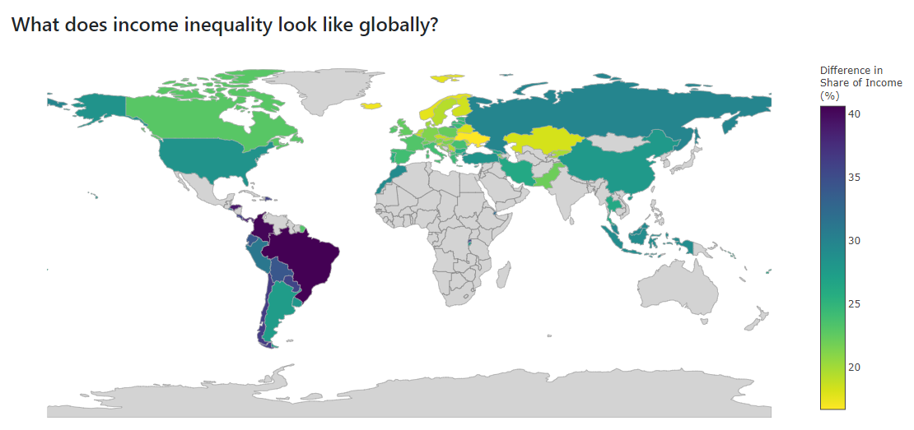
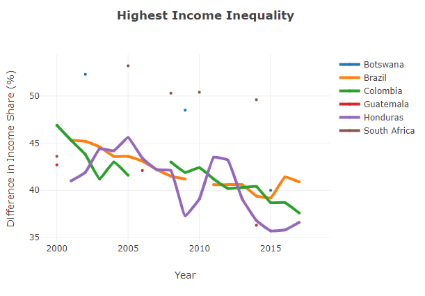
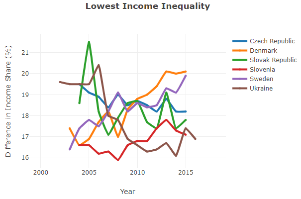
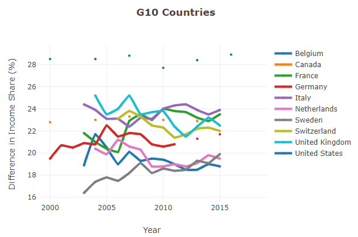
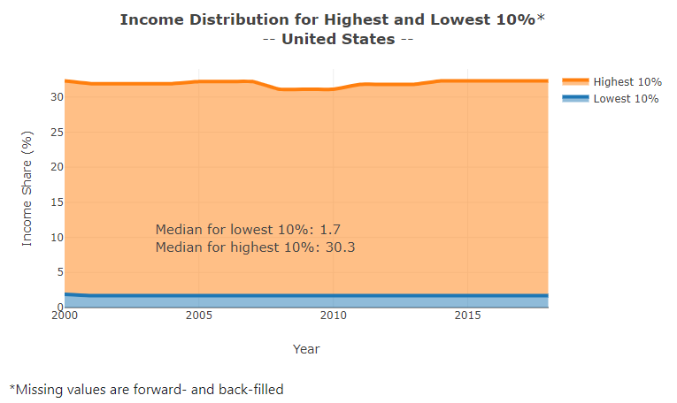

# Global Income Inequality

## Overview
Income inequality is a consideration for both social justice and economic reasons. This project explores the differences in income share between the top 10% and bottom 10% of earners across countries. Using visualizations income inequality is explored globally, in change over time and at an individual country level. All data comes from [The World Bank](https://data.worldbank.org/).

A web app was created to dynamically query the API based on the last data pull date and display interactive visualizations of the data. The text supporting the visualizations acts as a call to action in response to the findings.

The app can be viewed [here](https://world-income-inequality.herokuapp.com/).

## Technologies Used
- Python
  - Libraries: pandas, plotly, flask, gunicorn, requests
- HTML, CSS:
  - Bootstrap
- World Bank Data API
- Heroku (hosting)

## Methodology
### Data Preprocessing
All exploration of data prepocessing can be found in this [notebook](https://github.com/rebeccaebarnes/income-inequality/blob/master/poverty_web_app.ipynb).

The following steps were taken:
- The World Bank API was queried and saved (with code developed to only query if data is not up to date)
- Separate JSON files were combined to create a single dataframe
- Determinations were made to manage the substantial missing data by selecting years and countries that had sufficient data
- The difference between high and low earners was calculated
- Three figure country codes (as opposed to two figure codes from The World Bank) were located and joined to the data

### Implementation
It was determined that a web app would be built to display the results using plotly to provide an interactive experience for users.

The following plots were utilized:
- Choropleth: Provides an overview of the status of income inequality across the globe
- Line plots: Show the change in income inequality over time. To maintain readability, plots were made of the six countries with the highest and lowest differences income and the world's top 10 economies.
- Stacked line plot: Allow the user to select a country of their choice to explore the income share of the top and bottom 10%

The primary complication of the process was in managing the missing data. Many countries do not collect metrics of income inequality on a regular basis. While data was available for some countries after 2013, it was the most recent year that had substantial data and so was used for plotting the choropleth so that all countries were compared equally.

Line plots had to be adjusted to include plots of dots for countries that do not collect income inequality data on an annual basis. Filling of missing values was also required for the stacked line plot to create a plot that appropriately progressed through the years.

One other challenge revolved around managing the appearance of the web app on different screen sizes.

### Refinement
The intended original dataset was a measure of the proportion of the country living in poverty. However, there was so much missing data that this was not viable (see the notebook linked above). As a result, the fields related to income share for the top and bottom 10% were identified as an alternative.

The initial visualizations were conducted using seaborn, and basic plotly templates that are also found in the notebook. (The notebook code must be run to display the initial plotly visualizations)

When plotting the line plots, originally larger selections of countries were used, but these made the plots difficult to read, so the plots were reduced to less than 10. The location of the tooltips that appear when hovering over the charts was also adjusted to assist in interpretation.

Originally the stacked line chart was filled with the median of the years but this distorted the progression of income inequality over the years as it would cause artificial increases or decreases. Forward-filling, followed by back-filling was selected as a better way to capture the changes in income inequality over time.

These plots were further refined to increase their aesthetic value including changing line widths, font sizes, and bolding of text.

## Results
The findings of the analysis are as follows

  

- Countries from South America and Africa tend to have the highest income inequality

  

- Europe has the countries with the lowest income inequality

  

- Income inequality has been decreasing over time for countries with the highest income inequality
- For G10 countries, income inequality was relatively stable between 2010 and 2015, but some are showing increases in difference in recent years

  

- Income inequality does appear to generally be decreasing but the gap between the income share for most countries remains large: the lowest 10% typically earns approximately 3% of the income share while the top 10% can often early close to 30%. The reduction in the difference is also typically not a result of substantial increases in the share of income for the lowest 10% but decreases in income share for the top 10%.

  

## Conclusion
### Reflection
The project equally involved developing data analysis and web development skills. It was quite satisfying to build the implementation of a data science project from end to end and produce a product that is available online and can be viewed by others.

Understanding how to effectively display the results in a functional manner on the web involved at least as much time as the data analysis and visualization process. I appreciated that the fact that the tools that have been introduced to us through the course are well-supported online - it was not hard to find troubleshooting suggestions to the problems that were encountered in building the web app.

### Improvement
Once the project was deployed it was shared with others and their feedback was gathered. Additional improvements focused on improving the user experience such as ensuring that when the page reloaded to create the chosen stacked line chart that the user was returned to that section of the page.

## Acknowledgements
Key functionality for flask/html integration was derived from Udacity Data Science nanodegree [course materials](https://github.com/udacity/DSND_Term2/tree/master/lessons/WebDevelopment/AdvancedDataDashboardCode/world_bank_api_dashboard).
